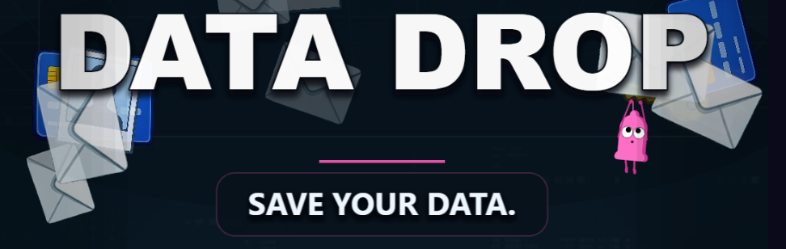

<p align="center">
  
</p>
<p align="center">
  <a href="https://feliperyba.github.io/playable-ad-phaser/" style="font-size: 2em;">Live Demo</a>
</p>

Data Drop is a Phaser showcase project for training and experimentation around playable ads. It demonstrates how to build a polished vertical mini-game with TypeScript, Phaser, and Vite, then package the result as a single self-contained HTML file suitable for handoff, review, or playable-ad platform adaptation.

The production build emits `dist/index.html`. The JavaScript bundle, styles, and imported assets are inlined into that file, with binary assets such as PNG and WOFF2 files base64-encoded as embedded data URIs so the ad can run without a separate asset folder.

## Demo Concept

The player protects falling personal data before it drops into the dark-web abyss.

- Move the shield with pointer or touch input.
- Catch safe data items to score points.
- Avoid malware items that damage the player.
- Letting too many safe items leak costs a life.
- Scanner sweeps temporarily reveal whether items are safe or dangerous.
- Combos increase the score multiplier and extend scanner uptime.
- The result screen stores a local high score and includes a CTA link.

The game is authored for a vertical playable-ad canvas at `1080 x 1920` and scales to the available viewport with Phaser's `FIT` scale mode.

## Tech Stack

- Phaser 3 for rendering, input, physics, particles, tweens, cameras, and scene management.
- TypeScript for strict game logic and project structure.
- Vite for development, production bundling, and asset processing.
- `vite-plugin-singlefile` for single-file HTML output.
- Terser for production minification.

## Project Structure

```text
.
|-- index.html                 # Vite entry point and Phaser mount element
|-- vite.config.ts             # Vite build, alias, minification, and single-file config
|-- tsconfig.json              # TypeScript compiler options and path aliases
|-- src
|   |-- main.ts                # Phaser game config and scene registration
|   |-- config
|   |   `-- constants.ts       # Gameplay tuning, layout, copy, colors, and texture keys
|   |-- assets
|   |   |-- assetManifest.ts   # Imported asset URLs used by Phaser preload
|   |   `-- ...                # PNG, SVG, and font assets
|   |-- entities
|   |   |-- FallingItem.ts     # Data item behavior, scanner reveal, collision samples
|   |   `-- Shield.ts          # Player shield input, hit band, visuals, feedback
|   |-- scenes
|   |   |-- BootScene.ts       # Asset preload and generated runtime textures
|   |   |-- MenuScene.ts       # Animated start screen
|   |   |-- GameScene.ts       # Core gameplay loop and HUD
|   |   `-- GameOverScene.ts   # Results, high score, replay, and CTA
|   `-- systems
|       |-- DifficultyManager.ts
|       |-- Scanner.ts
|       `-- Spawner.ts
`-- dist
    `-- index.html             # Generated single-file build
```

## Getting Started

Install dependencies:

```bash
npm install
```

Start the local development server:

```bash
npm run dev
```

Build the production output:

```bash
npm run build
```

Preview the production build:

```bash
npm run preview
```

By default, the Vite dev server is configured for port `8080`.

## Build Output

The production build runs:

```bash
tsc && vite build
```

Vite uses `index.html` as the application entry point and loads `src/main.ts` as the module entry. The build config then:

- inlines imported assets and JavaScript into `dist/index.html`;
- uses `base: "./"` so the generated file remains portable;
- removes the Vite module loader through `vite-plugin-singlefile`;
- minifies the output with Terser;
- keeps `console.warn` and `console.error`, while dropping lower-priority console calls configured as pure functions.

The current reviewed build produces a single `dist/index.html` file of roughly 3 MB before transfer compression.

## Architecture Notes

The scene flow is intentionally simple:

1. `BootScene` preloads assets from `assetManifest.ts`, generates Phaser textures for scanner beams, buttons, abyss effects, particles, rails, and vignettes, then starts the menu.
2. `MenuScene` presents an animated playable-ad style landing moment and starts the game on pointer input.
3. `GameScene` owns the active run: spawning, difficulty progression, shield interaction, scoring, combo decay, scanner state, lives, HUD, and transition to game over.
4. `GameOverScene` displays the score tier, best streak, local high score, feature rails, replay action, and external CTA.

Gameplay behavior is split into small runtime classes:

- `Spawner` owns weighted item spawning and active item cleanup.
- `DifficultyManager` interpolates wave speed, spawn interval, and malware ratio over time.
- `Scanner` schedules scanner sweeps, updates scanner progress, and asks active items to reveal their state.
- `FallingItem` owns per-item visuals, scanner overlays, malware hints, glow effects, and alpha-sampled collision points.
- `Shield` owns pointer tracking, catch-band geometry, combo-size changes, and visual feedback.

## Asset Pipeline

Assets are imported through `src/assets/assetManifest.ts` instead of being referenced by raw string paths throughout the scenes. This keeps texture keys stable and gives Vite a single place to discover assets for bundling and inlining.

For new assets:

1. Add the file under `src/assets`.
2. Import it in `src/assets/assetManifest.ts`.
3. Add or reuse a texture key in `src/config/constants.ts`.
4. Load it in `BootScene.preload()`.
5. Reference the texture key from scenes, entities, or systems.

This pattern is important for playable ads because every asset that must ship with the ad needs to be reachable from the bundler.

## Playable-Ad Handoff Notes

- `dist/index.html` is the handoff artifact.
- The game does not require a separate asset directory after build.
- The CTA URL is configured in `RESULT_SCREEN.CTA_URL` in `src/config/constants.ts`.
- The current end-card CTA uses `window.open(...)`; some ad networks require replacing that call with their SDK exit API.
- The result screen uses `localStorage` for a high score; remove or adapt that behavior if a target platform disallows persistent storage.
- The game uses WebGL through Phaser. Confirm WebGL availability in any target playable-ad environment.
- The production file size depends heavily on Phaser, source assets, and minification settings. Check each ad network's compressed and uncompressed file-size limits before submission.

## Customization Points

Most tuning is centralized in `src/config/constants.ts`:

- canvas size and layout coordinates;
- item weights, score values, and dimensions;
- wave speed, spawn interval, and malware ratio;
- lives and leak thresholds;
- scanner cooldown, duration, sweep speed, and reveal behavior;
- combo thresholds and multiplier rules;
- menu copy, result screen copy, CTA URL, and feature rail content.

Use these constants first before changing scene internals.

## License

MIT. See `LICENSE` for details.
